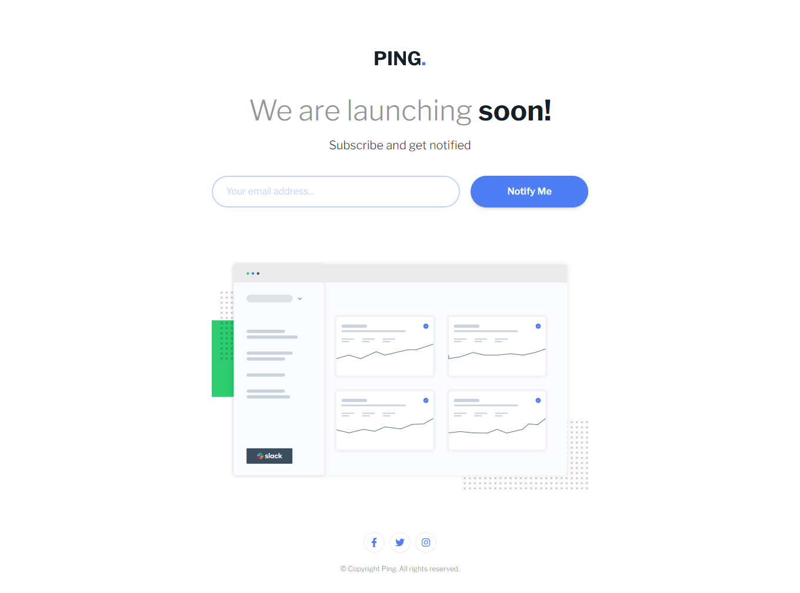

# Frontend Mentor - Ping coming soon page solution

This is a solution to the [Ping coming soon page challenge on Frontend Mentor](https://www.frontendmentor.io/challenges/ping-single-column-coming-soon-page-5cadd051fec04111f7b848da). Frontend Mentor challenges help you improve your coding skills by building realistic projects. 

## Table of contents

- [Overview](#overview)
  - [The challenge](#the-challenge)
  - [Screenshot](#screenshot)
  - [Links](#links)
- [My process](#my-process)
  - [Built with](#built-with)
- [Author](#author)

## Overview

### Screenshot

### Links

- [Solution URL](https://www.frontendmentor.io/solutions/ping-coming-soon-page-HBp3LKm3lt)
- [Live site URL](https://glittering-toffee-957f04.netlify.app/)

## My process

### Built with

- [React](https://reactjs.org/)
- [Tailwind CSS](https://tailwindcss.com/)
- [EsLint](https://www.npmjs.com/package/eslint)
- [Standard](https://www.npmjs.com/package/standard)
- [React icons](https://www.npmjs.com/package/react-icons)

## Author

- Frontend Mentor - [Christian](https://www.frontendmentor.io/profile/flchris)